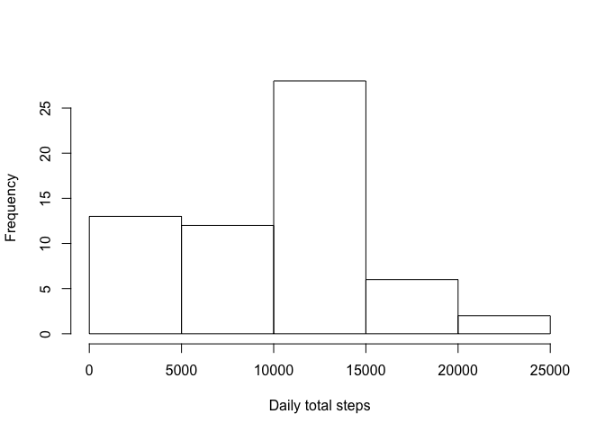
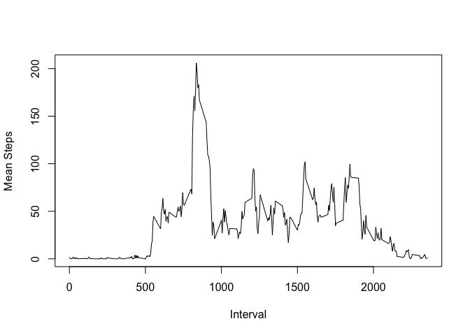
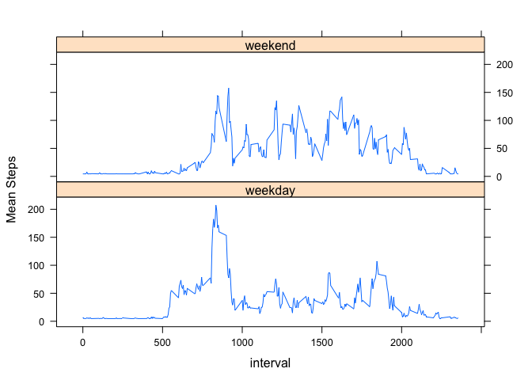

# Reproducible Research: Peer Assessment 1


## Loading and preprocessing the data


```r
activity <- read.csv("activity.csv")
```

## What is mean total number of steps taken per day?

First we need to know the total number of days each day.

```r
library(dplyr)
```

```
## 
## Attaching package: 'dplyr'
## 
## The following object is masked from 'package:stats':
## 
##     filter
## 
## The following objects are masked from 'package:base':
## 
##     intersect, setdiff, setequal, union
```

```r
daily.totals <- activity %>%
        group_by(date)%>%
        summarize(total=sum(steps,na.rm=TRUE))
daily.mean <- with(daily.totals,mean(total))
daily.median <- with(daily.totals,median(total))
print(daily.mean)
```

```
## [1] 9354.23
```

```r
print(daily.median)
```

```
## [1] 10395
```
The mean total number of steps taken each day is 9354.23 steps per day. The median is 10395 steps per day.


```r
hist(daily.totals$total,xlab="Daily total steps",main="")
```

 

## What is the average daily activity pattern?

First we need to compute the average number of steps in each 5-minute interval.

```r
interval.means <- activity %>%
      group_by(interval) %>%
      summarize(int.mean=mean(steps,na.rm=TRUE))
with(interval.means,plot(interval,int.mean,type="l",ylab="Mean Steps",xlab="Interval"))
```

 

```r
most.active <- interval.means[max(interval.means$int.mean),"interval"]
```
The interval 1705 has the most number of steps, on average.

## Imputing missing values

### Finding the number of NA rows


```r
missing.values <- nrow(activity)-nrow(na.omit(activity))
missing.values
```

```
## [1] 2304
```
There are 2304 rows with NA values.

### Strategy for imputing missing values

To impute values to use for the missing values, I will use the mean steps for the relevant 5-minute interval.

```r
# create a new dataframe activity2 that has imputed values in place of NA values
activity2 <- activity
activity2$steps[is.na(activity2$steps)]<- mean(activity2$steps[activity2$interval],na.rm=TRUE)

# now compute totals and means based on imputed values
daily.totals2 <- activity2 %>%
        group_by(date)%>%
        summarize(total=sum(steps))
daily.mean2 <- with(daily.totals2,mean(total))
daily.median2 <- with(daily.totals2,median(total))
print(daily.mean2)
```

```
## [1] 10698.1
```

```r
print(daily.median2)
```

```
## [1] 10395
```
After replacing NA values with imputed values, the daily mean changes from 9354.23 to 10698.1. There is no change in the daily median: in the original data it is  10395 and in the revised dataset with the imputed values it is 10395

## Are there differences in activity patterns between weekdays and weekends?


```r
# First, convert date variable to proper date variable.
activity2$date <- as.Date(activity2$date,"%Y-%m-%d")

# Now create new variable "day"
activity2$day <- "weekday"

# set day to "weekend" when day of the week is "Saturday" or "Sunday" and convert to factor
activity2$day[weekdays(activity2$date) %in% c("Saturday","Sunday")] <- "weekend"
activity2$day <- as.factor(activity2$day)

# create interval means
interval.means2 <- activity2 %>%
      group_by(day,interval) %>%
      summarize(int.mean=mean(steps,na.rm=TRUE))

# now generate plot
library(lattice)
plot1 <- xyplot(int.mean~interval|day,data = interval.means2,layout=c(1,2),type="l",ylab="Mean Steps")
plot1
```

 

